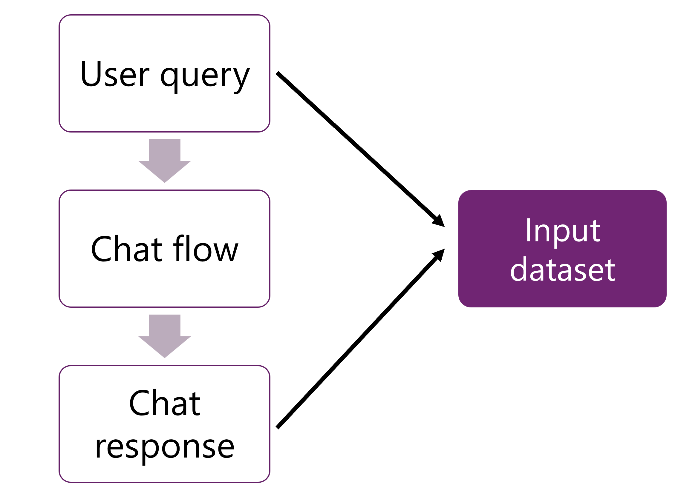

---
lab:
  title: Azure AI Foundry でカスタム コパイロットのパフォーマンスを評価する
---

# Azure AI Foundry でカスタム コパイロットのパフォーマンスを評価する

この演習では Azure AI Foundry ポータルを使用して、組み込みとカスタムの評価を確認し、AI アプリケーションのパフォーマンスを評価および比較します。

この演習には約 **30** 分かかります。

## Azure AI Foundry の中で AI ハブとプロジェクトを作成する

まずは、次のように Azure AI ハブの中で Azure AI Foundry プロジェクトを作成します。

1. Web ブラウザーで [https://ai.azure.com](https://ai.azure.com) を開き、Azure の資格情報を使ってサインインします。
1. **[ホーム]** ページを選択してから、**[+ 新しいプロジェクト]** を選択します。
1. **プロジェクトの作成**ウィザードで、プロジェクトの一意の名前を指定し、**[カスタマイズ]** を選択して次の設定を行います。
    - **ハブ名**:*一意の名前*
    - **[サブスクリプション]**:"*ご自身の Azure サブスクリプション*"
    - **[リソース グループ]**: "新しいリソース グループ"**
    - **場所**: **[選択に関するヘルプ]** を選択し、次に [場所ヘルパー] ウィンドウで **gpt-35-turbo** を選択し、推奨されるリージョンを選択します\*
    - **Azure AI サービスまたは Azure OpenAI に接続**: (新機能) *選択したハブ名が自動入力されます*
    - **Azure AI 検索への接続**:接続をスキップする

    > \* Azure OpenAI リソースは、リージョンのクォータによってテナント レベルで制限されます。 場所ヘルパーに一覧表示されているリージョンには、この演習で使用されるモデル タイプの既定のクォータが含まれています。 リージョンをランダムに選択すると、1 つのリージョンがクォータ制限に達するリスクが軽減されます。 演習の後半でクォータ制限に達した場合は、別のリージョンに別のリソースを作成する必要が生じる可能性があります。 詳しくは、[リージョンごとのモデルの可用性](https://learn.microsoft.com/azure/ai-services/openai/concepts/models#gpt-35-turbo-model-availability)を参照してください

1. **[次へ]** を選択し、構成を確認します。
1. **[プロジェクトの作成]** を選択し、プロセスが完了するまで待ちます。

## GPT モデルをデプロイする

プロンプト フロー内で言語モデルを使用するには、まずモデルを展開する必要があります。 Azure AI Foundry ポータルを使うと、フローで使用できる OpenAI モデルをデプロイできます。

1. 左側のメニューを使用して、**[マイ アセット]** セクションの **[モデル + エンドポイント]** ページに移動します。
1. **[+ モデルのデプロイ]** ボタンを選択し、**[基本モデルのデプロイ]** オプションを選択します。
1. **デプロイ モデル** ウィザードで **[カスタマイズ]** を選択して、以下の設定で **gpt-35-turbo** モデルの新しいデプロイを作成します。
    - **デプロイ名**:"モデル デプロイの一意の名前"**
    - **デプロイの種類**:Standard
    - **モデルのバージョン**: *Select the default version (既定のバージョンの選択)*
    - **AI リソース**: *以前に作成したリソースを選択します*
    - **1 分あたりのトークン数のレート制限 (1,000 単位)**:5,000
    - **コンテンツ フィルター**: DefaultV2
    - **動的クォータを有効にする**: 無効

    > **注**: 現在の AI リソースの場所に、デプロイするモデルで使用可能なクォータがない場合は、新しい AI リソースが作成され、プロジェクトに接続される別の場所を選択するように求められます。

1. モデルが展開されるまで待ちます。 展開の準備ができたら、**[プレイグラウンドで開く]** を選択します。
1. **[モデルの指示とコンテキストを指定する]** テキスト ボックスで、内容を以下のように変更します。

   ```
   **Objective**: Assist users with travel-related inquiries, offering tips, advice, and recommendations as a knowledgeable travel agent.

   **Capabilities**:
   - Provide up-to-date travel information, including destinations, accommodations, transportation, and local attractions.
   - Offer personalized travel suggestions based on user preferences, budget, and travel dates.
   - Share tips on packing, safety, and navigating travel disruptions.
   - Help with itinerary planning, including optimal routes and must-see landmarks.
   - Answer common travel questions and provide solutions to potential travel issues.
    
   **Instructions**:
   1. Engage with the user in a friendly and professional manner, as a travel agent would.
   2. Use available resources to provide accurate and relevant travel information.
   3. Tailor responses to the user's specific travel needs and interests.
   4. Ensure recommendations are practical and consider the user's safety and comfort.
   5. Encourage the user to ask follow-up questions for further assistance.
   ```

1. **[変更の適用]** を選択します。
1. チャット (履歴) ウィンドウ内でクエリ「`What can you do?`」を入力して、言語モデルが想定どおりに動作していることを確認します。

これで、更新されたシステム メッセージを含むモデルが展開されたので、モデルを評価できます。

## Azure AI Foundry ポータルで言語モデルを手動で評価する

テスト データに基づいて、モデルの応答を手動で確認できます。 手動で確認すると、さまざまな入力を一度に 1 つずつテストして、モデルが想定どおりに実行されるかどうかを評価できます。

1. **[チャット プレイグラウンド]** の上部のバーから **[評価]** ドロップダウンを選択し、**[手動評価]** を選択します。
1. **システム メッセージ**を上記で使用したものと同じメッセージに変更します (ここにも入れます)。

   ```
   **Objective**: Assist users with travel-related inquiries, offering tips, advice, and recommendations as a knowledgeable travel agent.

   **Capabilities**:
   - Provide up-to-date travel information, including destinations, accommodations, transportation, and local attractions.
   - Offer personalized travel suggestions based on user preferences, budget, and travel dates.
   - Share tips on packing, safety, and navigating travel disruptions.
   - Help with itinerary planning, including optimal routes and must-see landmarks.
   - Answer common travel questions and provide solutions to potential travel issues.
    
   **Instructions**:
   1. Engage with the user in a friendly and professional manner, as a travel agent would.
   2. Use available resources to provide accurate and relevant travel information.
   3. Tailor responses to the user's specific travel needs and interests.
   4. Ensure recommendations are practical and consider the user's safety and comfort.
   5. Encourage the user to ask follow-up questions for further assistance.
   ```

1. **[手動評価の結果]** セクション内で、出力を確認する 5 つの入力を追加します。 5 つの個別の**入力**として、次の 5 つの質問を入力します。

   `Can you provide a list of the top-rated budget hotels in Rome?`

   `I'm looking for a vegan-friendly restaurant in New York City. Can you help?`

   `Can you suggest a 7-day itinerary for a family vacation in Orlando, Florida?`

   `Can you help me plan a surprise honeymoon trip to the Maldives?`

   `Are there any guided tours available for the Great Wall of China?`

1. 上部のバーから **[実行]** を選択して、入力として追加したすべての質問の出力を生成します。
1. 応答の右下にある "サムズアップ" または "サムズダウン" のアイコンを選択して、各質問の出力を手動で確認できるようになりました。 各応答を評価して、少なくとも 1 つの "サムズアップ" と、1 つの "サムズダウン" の応答を評価の中に含めてください。
1. 上部のバーから **[結果の保存]** を選択します。 この結果の名前として「`manual_evaluation_results`」と入力します。
1. 左側のメニューを使用して、**[評価]** に移動します。
1. **[手動評価]** タブを選択して、つい先ほど保存した手動評価を見つけます。 以前に作成した手動評価を確認し、中断したところから続行して、その更新した評価を保存できることに注目してください。

## 組み込みのメトリックを使用して Copilot を評価する

プロンプト フローを使用してチャット アプリケーションを作成すると、バッチ実行をして、組み込みのメトリックによりフローのパフォーマンスを評価することで、フローを評価できます。



チャット フローを評価するために、ユーザーのクエリとチャット応答が評価の入力として提供されます。

時間を節約するために、プロンプト フローによって処理される複数の入力の結果を含むバッチ出力データセットを作成しました。 各結果は、次の手順で評価するデータセットに格納されます。

1. **[自動評価]** タブを選択し、次の設定を使用して**新しい評価**を作成します。<details>  
      <summary><b>トラブルシューティングのヒント</b>: アクセス許可エラー</summary>
        <p>新しいプロンプト フローを作成するときにアクセス許可エラーが発生した場合は、次のトラブルシューティングを試してください。</p>
        <ul>
          <li>Azure portal で、AI サービス リソースを選択します。</li>
          <li>[リソース管理] の下の [ID] タブで、それがシステム割り当てマネージド ID であることを確認します。</li>
          <li>関連付けられたストレージ アカウントに移動します。 [IAM] ページで、<em>[ストレージ BLOB データ閲覧者]</em> というロールの割り当てを追加します。</li>
          <li><strong>[アクセスの割り当て先]</strong> で、<strong>[マネージド ID]</strong>、<strong>[+ メンバーの選択]</strong> を選択し、<strong>[すべてのシステム割り当てマネージド ID]</strong> を選択します。</li>
          <li>[確認と割り当て] で新しい設定を保存し、前の手順を繰り返します。</li>
        </ul>
    </details>

    - **[評価の対象は?]**: データセット
    - **[評価名]**:*一意の名前を入力*
    - **[次へ]** を選択します
    - **[評価するデータを選択する]**:データセットの追加
        - `https://raw.githubusercontent.com/MicrosoftLearning/mslearn-ai-studio/main/data/travel-qa.jsonl` で[検証データセット](https://raw.githubusercontent.com/MicrosoftLearning/mslearn-ai-studio/main/data/travel-qa.jsonl)をダウンロードし、JSONL ファイルとして保存して UI にアップロードします。

    > **注**: デバイスにおいて、デフォルトでファイルを .txt ファイルとして保存するようになっている場合があります。 すべてのファイルを選択し、.txt サフィックスを削除して、ファイルが JSONL として保存されるようにしてください。

    - **[次へ]** を選択します
    - **[メトリックの選択]**:コヒーレンス、流暢性
    - **[接続]**:AI サービス接続**
    - **[デプロイ名/モデル]**:展開した GPT-3.5 モデル**
    - **[クエリ]**: データ ソースとして**クエリ**を選択
    - **[応答]**: データ ソースとして**応答**を選択
      
1. **[次へ]** を選択してデータを確認し、新しい評価を **[送信]** します。
1. 評価が完了するまで待ちます。更新が必要になる場合があります。
1. つい先ほど作成した評価の実行を選択します。
1. **[メトリック ダッシュボード]** と **[詳細なメトリックの結果]** を確認します。

## Azure リソースを削除する

Azure AI Foundry を調べ終わったら、Azure の不要なコストを避けるため、作成したリソースを削除する必要があります。

- [Azure portal](https://portal.azure.com) (`https://portal.azure.com`) に移動します。
- Azure portal の **[ホーム]** ページで、**[リソース グループ]** を選択します。
- この演習のために作成したリソース グループを選びます。
- リソース グループの **[概要]** ページの上部で、**[リソース グループの削除]** を選択します。
- リソース グループ名を入力して、削除することを確認し、**[削除]** を選択します。
