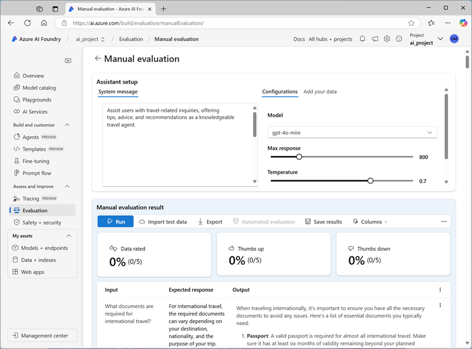

---
lab:
  title: 生成 AI のパフォーマンスを評価する
  description: モデルとプロンプトを評価して、チャット アプリのパフォーマンスと適切に応答する能力を最適化する方法について学習します。
---

# 生成 AI のパフォーマンスを評価する

この演習では、手作業および自動の評価を使用して、Azure AI Foundry ポータルでモデルのパフォーマンスを評価します。

この演習には約 **30** 分かかります。

## Azure AI Foundry プロジェクトを作成する

まず、Azure AI Foundry プロジェクトを作成します。

1. Web ブラウザーで [Azure AI Foundry ポータル](https://ai.azure.com) (`https://ai.azure.com`) を開き、Azure 資格情報を使用してサインインします。 初めてサインインするときに開いたヒントまたはクイック スタート ウィンドウを閉じます。また、必要に応じて左上にある **Azure AI Foundry** ロゴを使用してホーム ページに移動します。それは次の画像のようになります (**[ヘルプ]** ウィンドウが開いている場合は閉じます)。

    

1. ホーム ページで、**[+ 作成]** を選択します。
1. **[プロジェクトの作成]** ウィザードで、有効なプロジェクト名を入力し、既存のハブが推奨された場合は、新しいハブを作成するオプションを選択します。 次に、ハブとプロジェクトをサポートするために自動的に作成される Azure リソースを確認します。
1. **[カスタマイズ]** を選択し、ハブに次の設定を指定します。
    - **ハブ名**: *ハブの有効な名前*
    - **[サブスクリプション]**:"*ご自身の Azure サブスクリプション*"
    - **リソース グループ**: *リソース グループを作成または選択します。*
    - **場所**: 次のいずれかのリージョンを選択します\*
        - 米国東部 2
        - フランス中部
        - 英国南部
        - スウェーデン中部
    - **Azure AI サービスまたは Azure OpenAI への接続**: *新しい AI サービス リソースを作成します*
    - **Azure AI 検索への接続**:接続をスキップする

    > \* 執筆時点では、これらのリージョンは AI の安全性メトリックの評価をサポートしています。

1. **[次へ]** を選択し、構成を確認します。 **[作成]** を選択し、プロセスが完了するまで待ちます。
1. プロジェクトが作成されたら、表示されているヒントをすべて閉じて、Azure AI Foundry ポータルのプロジェクト ページを確認します。これは次の画像のようになっているはずです。

    

## モデルを展開する

この演習では、GPT-4o-mini モデルのパフォーマンスを評価します。 また、GPT-4o モデルを使用して、AI 支援評価メトリックを生成します。

1. プロジェクトの左側のナビゲーション ウィンドウの **[マイ アセット]** セクションで、**[モデル + エンドポイント]** ページを選択します。
1. **[モデル + エンドポイント]** ページの **[モデル デプロイ]** タブの **[+ モデルのデプロイ]** メニューで、**[基本モデルのデプロイ]** を選択します。
1. 一覧で **GPT-4o** モデルを検索してから、それを選択して確認します。
1. デプロイの詳細で **[カスタマイズ]** を選択して、以下の設定でモデルをデプロイします。
    - **デプロイ名**: モデル デプロイの有効な名前**
    - **デプロイの種類**: グローバル標準
    - **バージョンの自動更新**: 有効
    - **モデルのバージョン**: *利用可能な最新バージョンを選択します*
    - **接続されている AI リソース**: *使用している Azure OpenAI リソース接続を選択します*
    - **1 分あたりのトークンのレート制限 (1,000)**: 50,000 * (または 50,000 未満の場合はサブスクリプションで使用可能な最大値)*
    - **コンテンツ フィルター**: DefaultV2

    > **注**:TPM を減らすと、ご利用のサブスクリプション内で使用可能なクォータが過剰に消費されることを回避するのに役立ちます。 この演習で使用するデータには、50,000 TPM で十分です。 使用可能なクォータがこれより低い場合は、演習を完了できますが、レート制限を超えるとエラーが発生する可能性があります。

1. デプロイが完了するまで待ちます。
1. **[モデル + エンドポイント]** ページに戻り、前の手順を繰り返して、同じ設定で **GPT-4o-mini** モデルをデプロイします。

## モデルを手作業で評価する

テスト データに基づいて、モデルの応答を手動で確認できます。 手作業で確認すると、さまざまな入力をテストして、モデルが期待どおりのパフォーマンスを見せるどうかを評価できます。

1. 新しいブラウザー タブで、`https://raw.githubusercontent.com/MicrosoftLearning/mslearn-ai-studio/refs/heads/main/data/travel_evaluation_data.csv`から [travel_evaluation_data.csv](https://raw.githubusercontent.com/MicrosoftLearning/mslearn-ai-studio/refs/heads/main/data/travel_evaluation_data.csv) をダウンロードし、ローカル フォルダーに保存します。
1. [Azure AI Foundry ポータル] タブに戻り、ナビゲーション ウィンドウの **[評価と改善]** セクションで、**[評価]** を選択します。
1. **[評価]** ページで、**[手作業評価]** タブを表示し、**[+ 新しい手作業評価]** を選択します。
1. AI 旅行アシスタント用に**システム メッセージ**を次の指示に変更します。

   ```
   Objective: Assist users with travel-related inquiries, offering tips, advice, and recommendations as a knowledgeable travel agent.

   Capabilities:
   - Provide up-to-date travel information, including destinations, accommodations, transportation, and local attractions.
   - Offer personalized travel suggestions based on user preferences, budget, and travel dates.
   - Share tips on packing, safety, and navigating travel disruptions.
   - Help with itinerary planning, including optimal routes and must-see landmarks.
   - Answer common travel questions and provide solutions to potential travel issues.
    
   Instructions:
   1. Engage with the user in a friendly and professional manner, as a travel agent would.
   2. Use available resources to provide accurate and relevant travel information.
   3. Tailor responses to the user's specific travel needs and interests.
   4. Ensure recommendations are practical and consider the user's safety and comfort.
   5. Encourage the user to ask follow-up questions for further assistance.
   ```

1. **[構成]** セクションの **[モデル]** の一覧で、**GPT-4o-mini** モデル デプロイを選択します。
1. **[手作業評価結果]** セクションで、**[テスト データのインポート]** を選択し、以前にダウンロードした **travel_evaluation_data.csv** ファイルをアップロードして、データセット フィールドを次のようにマッピングします。
    - **入力**: 質問
    - **期待される応答**: ExpectedResponse
1. テスト ファイル内の質問と期待される回答を確認します。これらを使用して、モデルが生成する応答を評価します。
1. 上部のバーから **[実行]** を選択して、入力として追加したすべての質問の出力を生成します。 数分後に、次のように、モデルからの応答が新しい**出力**列に表示されます。

    

1. 各質問に対する出力を確認し、モデルからの出力を期待される回答と比較し、各応答の右下にあるサムズアップまたはサムズダウンのアイコンを選択して結果を "採点" します。
1. 応答を採点したら、一覧の上にある概要タイルを確認します。 次にツール バーで、**[結果の保存]** を選択し、適切な名前を割り当てます。 結果を保存すると、後でそれらを取得して、さらに評価したり、別のモデルと比較したりすることができます。

## 自動評価を使用する

モデルの出力を自分の期待する応答と手作業で比較することは、モデルのパフォーマンスを評価する便利な方法ですが、さまざまな質問と回答が期待されるシナリオでは時間のかかるアプローチです。さまざまなモデルとプロンプトの組み合わせを比較するために使用できる標準化されたメトリックという形ではほとんど何も提供しません。

自動評価は、メトリックを計算し、AI を使用して一貫性、関連性、その他の要因に対する応答を評価することで、これらの欠点に対処しようとするアプローチです。

1. **[手作業評価]** ページ タイトルの横にある戻る矢印 (**&larr;**) を使用して、**[評価]** ページに戻ります。
1. **[自動評価]** タブを表示します。
1. **[新しい評価の作成]** を選択し、プロンプトが表示されたら、**モデルとプロンプト**を評価するオプションを選択します
1. **[新しい評価の作成]** ページの **[基本情報]** セクションで、既定の自動生成された評価名 (必要に応じて変更可能) を確認し、**GPT-4o-mini** モデル デプロイを選択します。
1. **システム メッセージ**を以前にAI 旅行アシスタント用に使用したのと同じ指示に変更します。

   ```
   Objective: Assist users with travel-related inquiries, offering tips, advice, and recommendations as a knowledgeable travel agent.

   Capabilities:
   - Provide up-to-date travel information, including destinations, accommodations, transportation, and local attractions.
   - Offer personalized travel suggestions based on user preferences, budget, and travel dates.
   - Share tips on packing, safety, and navigating travel disruptions.
   - Help with itinerary planning, including optimal routes and must-see landmarks.
   - Answer common travel questions and provide solutions to potential travel issues.
    
   Instructions:
   1. Engage with the user in a friendly and professional manner, as a travel agent would.
   2. Use available resources to provide accurate and relevant travel information.
   3. Tailor responses to the user's specific travel needs and interests.
   4. Ensure recommendations are practical and consider the user's safety and comfort.
   5. Encourage the user to ask follow-up questions for further assistance.
   ```

1. **[テスト データの構成]** セクションでは、GPT モデルを使用してテスト データを生成したり、(その後、自分の期待どおりになるように編集や補足をしたり）、既存のデータセットを使用したり、ファイルをアップロードしたりできることに注意してください。 この演習では、**[既存のデータセットの使用]** を選択してから、**travel_evaluation_data_csv_*xxxx...*** データセット (以前に.csv ファイルをアップロードしたときに作成されたもの) を選択します。
1. データセットのサンプル行を確認してから、**[データ列の選択]** セクションで、次の列マッピングを選択します。
    - **クエリ**: 質問
    - **コンテキスト**: *ここは空白にします。これは、コンテキスト データ ソースをモデルに関連付けるときに、"根拠" を評価するために使用されます。*
    - **真実**: ExpectedAnswer
1. **[評価する内容の選択]** セクションで、次の評価カテゴリの<u>すべて</u>を選択します。
    - AI 品質 (AI 支援)
    - リスクと安全性 (AI 支援)
    - AI 品質 (NLP)
1. **モデル デプロイをジャッジとして選択**一覧で、**GPT-4o** モデルを選択します。 このモデルは、***GPT-4o-mini** モデルからの応答を、言語関連の品質と標準的な生成 AI 比較メトリックについて評価するために使用されます。
1. **[作成]** を選択して、評価プロセスを開始し、それが完了するまで待ちます。 これには数分かかることがあります。

    > **ヒント**: プロジェクトのアクセス許可が設定されていることを示すエラーが表示される場合は、少し待ってから、**[作成]** をもう一度選択します。 新しく作成されたプロジェクトのリソースのアクセス許可が反映されるまでに時間がかかる場合があります。

1. 評価が完了したら、必要に応じて下にスクロールして**メトリック ダッシュボード**領域を表示し、**AI 品質 (AI 支援)** メトリックを表示します。

    

    **<sup>(i)</sup>** アイコンを使用して、メトリック定義を表示します。

1. **[リスクと安全性]** タブを表示して、有害な可能性のあるコンテンツに関連するメトリックを確認します。
1. **AI 品質 (NLP)** タブを表示して、生成 AI モデルの標準メトリックを確認します。
1. 必要に応じてページの上部までスクロールし、**[データ]** タブを選択して、評価の生データを確認します。 データには、各入力のメトリックと、応答を評価するときに適用される GPT-4o モデルの理由の説明が含まれます。

    

## クリーンアップ

Azure AI Foundry を調べ終わったら、Azure の不要なコストを避けるため、作成したリソースを削除する必要があります。

- [Azure portal](https://portal.azure.com) (`https://portal.azure.com`) に移動します。
- Azure portal の **[ホーム]** ページで、**[リソース グループ]** を選択します。
- この演習のために作成したリソース グループを選びます。
- リソース グループの **[概要]** ページの上部で、**[リソース グループの削除]** を選択します。
- リソース グループ名を入力して、削除することを確認し、**[削除]** を選択します。
