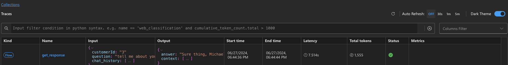

---
lab:
  title: コード優先の開発ツールを使用してカスタム Copilot を構築する
---

# コード優先の開発ツールを使用してカスタム Copilot を構築する

この演習では、Azure AI Studio 上の[オンライン エンドポイントに AI プロジェクトをプロビジョニングしてデプロイする](https://learn.microsoft.com/azure/developer/azure-developer-cli/azure-ai-ml-endpoints?WT.mc_id=academic-140829-cacaste) Azure Developer CLI テンプレートを複製してデプロイします。 そして、Azure AI とコード優先エクスペリエンスにより独自のカスタム Copilot を構築するための開始点として使用します。

この演習には約 **90** 分かかります。

## 開始する前に

この演習を完了するには、以下が必要です。

- プロジェクト リポジトリをフォークし、GitHub Codespaces 環境でテストするための GitHub アカウント。 [GitHub の](https://github.com/)無料アカウントを作成します。
- セマンティック ランカーをアクティブ化するための Basic レベルの Azure AI 検索。 [AI 検索の価格の詳細](https://azure.microsoft.com/pricing/details/search/)をご覧ください。
- 3 つの OpenAI モデル (`gpt-35-turbo`、`gpt-4`、`text-embedding-ada-002`) のデプロイ。 モデルをデプロイできるようにするには、十分なクォータを持つリージョンに AI ハブを作成する必要があります。 [モデルのリージョン可用性](https://learn.microsoft.com/azure/ai-services/openai/concepts/models?WT.mc_id=academic-140829-cacaste#model-summary-table-and-region-availability)をご覧ください。

## シナリオの理解

Azure Developer CLI AI プロジェクト テンプレートの使用を開始するには、「[Azure Developer CLI コレクションを使用した Azure AI テンプレート](https://learn.microsoft.com/collections/5pq0uompdgje8d/?WT.mc_id=academic-140829-cacaste)」に移動します。 コレクションを見て回ることで、マルチモーダル プロジェクトおよびマルチエージェント プロジェクトのサンプル、異なるフレームワークと Azure サービスを統合する Copilot のようなプロジェクトおよびサンプルなど、複数のプロジェクトがテクノロジ別やユース ケース別にグループ化していることがわかります。

この演習では、**[Azure AI Studio と PromptFlow (Python) を使用した Contoso チャット小売 Copilot](https://aka.ms/contoso-retail-sample)** プロジェクト テンプレートを出発点として使用します。 このプロジェクト テンプレートは、Prompty と PromptFlow を使用して、Contoso Outdoors という架空の会社の小売 Web サイト (チャット UI) に統合できるカスタム Copilot (チャット AI) を構築する、コード優先のエクスペリエンスです。


小売 Copilot ソリューションでは、会社の製品や顧客のデータにおいて、応答の基礎となる取得拡張生成 (RAG) パターンを使用します。 お客様は、小売チャットボットに会社の製品カタログに関する質問をしたり、以前の購入に基づいたおすすめを取得したりできます。

コレクションに含まれているプロジェクト リンクを選択すると、テンプレート コードをホストしている GitHub リポジトリにリダイレクトされます。 リポジトリの [README.md](https://github.com/Azure-Samples/contoso-chat/blob/main/README.md) ファイルには、アーキテクチャ、前提条件、プロジェクトのデプロイ手順など、プロジェクトの詳細な説明があります。


## GitHub Codespaces を設定する

この演習では、事前構成済みのクラウドでホストされる[開発コンテナー](https://docs.github.com/codespaces/setting-up-your-project-for-codespaces/adding-a-dev-container-configuration/introduction-to-dev-containers)をリポジトリから 1 回のクリックで直接起動できる GitHub 機能である、[GitHub Codespaces](https://github.com/features/codespaces) を使用します。 Codespaces には必要なすべてのツールと依存関係が既にプレインストールされているため、この方法により、ローカル開発環境を設定しなくても、コーディングをすばやく開始できます。

開発環境を初期化するには、次の手順に従います。

1. **リポジトリのフォーク**: GitHub リポジトリ ページの右上隅にある **[Fork]** (フォーク) ボタンを選択して、GitHub アカウントにリポジトリのコピーを作成します。
1. フォークしたリポジトリが作成されたら、**[Code]** (コード) ボタンを選択し、**[Codespaces]** を選択します。
1. **[+]** ボタンを選択して、フォークされたリポジトリのメイン ブランチに新しい codespace を作成します。

    

1. 数秒後に、既定で[アタッチされた Visual Studio Code エディター](https://code.visualstudio.com/docs/devcontainers/containers)を使用して Codespaces 環境がセットアップされる新しいブラウザー タブにリダイレクトされます。 このブラウザー タブで作業を続けるか、左上のメニューの **[Open in VS Code Desktop]** (VS Code Desktop で開く) ボタンをクリックすることで、ローカルの Visual Studio Code エディターから実行中の Codespaces に再接続することができます。

## VS Code 環境を Azure に接続する

次の手順では、ローカル開発環境を、プロジェクトをデプロイする Azure サブスクリプションと接続します。 Visual Studio Code IDE で新しいターミナルを開いて開始します。

1. 最初に、[最新バージョン](https://github.com/Azure/azure-dev/releases/tag/azure-dev-cli_1.9.3)の Azure Developer CLI がインストールされていることを確認します。
    ```bash
        azd version
    ```

1. 次に、VS Code ターミナルから Azure アカウントにサインインします。

    ```bash
        azd auth login 
    ```

## プロジェクト用に Azure リソースをプロビジョニングする

ログインすると、サブスクリプション内のプロジェクト用の Azure リソースのプロビジョニングを開始できます。 これは、ログインに使用したのと同じ VS Code ターミナルで行うことができます。

1. azd を使用して AI アプリケーションのプロビジョニングと*デプロイ*をします。

    ```bash
        azd up
    ```

1. 次のプロンプトが表示されるはずです。 次のガイダンスを使用して対応してください。
    - **新しい環境名を入力する:** *リソース グループ名を作成するのに使用*。
    - **使用する Azure サブスクリプションを選択する**: *Azure OpenAI モデルにアクセスできるサブスクリプションを選択します。*
    - **使用する Azure の場所を選択する**: *モデル クォータが使用可能な場所を選択します*。

    > [モデルの概要テーブルとリージョンの可用性](https://learn.microsoft.com/en-us/azure/ai-services/openai/concepts/models?WT.mc_id=academic-140829-cacaste#model-summary-table-and-region-availability)を使用して、必要なリージョンを見つけてください。 たとえば、`sweden central` は、Azure OpenAI モデルの大部分が使用できるリージョンであるため、Azure の場所として使用できます。

## Azure portal を使用してプロビジョニングを検証する

azd を使用した AI アプリケーションのプロビジョニングとデプロイは、完了するまでに 10 分以上かかる可能性があります。 進行状況は次の方法で追跡できます。

- [Azure portal](https://ms.portal.azure.com/) で詳細な進行状況を表示する。 環境名に対応するリソース グループを検索します。 サイドバーで **[デプロイ]** オプションを選択し、作成中のリソースのデプロイ状態を監視します。
- [Azure AI Studio](https://ai.azure.com) ポータルにアクセスする。 Azure アカウントを使用してサインインします。 上記のリソース グループに対応する AI ハブを検索します (数回更新する必要がある場合があります)。 一覧表示されている AI プロジェクトを選択し、サイドバーで **[デプロイ]** を選択して、モデルとチャット アプリケーションのデプロイの状態を追跡します。

Azure portal を使用してリソースのプロビジョニングを検証する方法を見てみましょう。

1. ブラウザーで [Azure portal](https://ms.portal.azure.com/) にアクセスします。
1. サインインして、先ほど入力したサブスクリプションと環境名に対応するリソース グループを見つけます。 **[概要]** パネルは次のようになるはずです。

    

1. まず、主要な [Azure AI Studio アーキテクチャ](https://learn.microsoft.com/azure/ai-studio/concepts/architecture) リソースが作成されたことを確認します。 次の図は、これらの各リソースが AI アプリケーションに提供するものの詳細を示しています。

    - **Azure AI ハブ**: 最上位レベルの Azure リソース。 チームのコラボレーション環境を提供します。
    - **Azure AI プロジェクト**: ハブの子。 オーケストレーション、カスタマイズ用のアプリ コンポーネントをグループ化します。
    - **Azure AI サービス**: モデル エンドポイントを管理します。

    

1. 次に、クエリ駆動型の取得用に製品と顧客のデータを格納することで[取得拡張生成](https://learn.microsoft.com/azure/ai-studio/concepts/retrieval-augmented-generation)設計パターンを実装するための、2 つの主要なリソースがプロビジョニングされたことを確認します。

    - **Search Service**: 製品カタログ データの検索インデックスを管理するためのもの。
    - **Azure Cosmos DB アカウント**: 顧客注文データのデータベースを作成するためのもの。

1. 次に、AI アプリケーションのニーズを管理するためのサポート リソースがあることを検証できます。

    - **Application Insights**: デプロイされたアプリケーションの監視とテレメトリをサポートするためのもの。
    - **Container Registry**: プロジェクトで使用される Docker イメージを非公開で格納および管理するためのもの。
    - **Key Vault**: プロジェクト シークレット (キー、資格情報) を安全に格納するためのもの。
    - **ストレージ アカウント**: AI プロジェクト管理に関連するデータ (ログを含む) を格納するためのもの。
    - **スマート検出機能アラート ルール**: Application Insights の Anomaly Detector (要求用)。

1. 最後になりましたが、**Machine Learning オンライン デプロイ**という種類の新しいリソースが登場します。 これは、デプロイされた Azure AI プロジェクト エンドポイント (チャット Copilot 用) に対応するリソースです。

## Azure AI Studio を使用してデプロイを検証する

Azure portal は、プロジェクトの基になる Azure リソースを管理するのに役立ちます。 Azure AI Studio ポータルを使用すると、モデルの選択からアプリケーションのデプロイまで、AI プロジェクト自体をエンドツーエンドで*構築および管理*することができます。 `azd up` コマンドは、必要なモデルのプロビジョニングから、使用のための Copilot API エンドポイントのデプロイおよびホストまで、プロセス全体を完了している必要があります。 アプリケーションが期待どおりに機能していることを確認しましょう。

1. [Azure AI Studio](https://ai.azure.com/manage) の **[管理]** ページにアクセスして、サブスクリプション内のすべての Azure AI ハブを表示します。
1. リソース グループのハブを選択して、その中のすべての Azure AI プロジェクトを表示します。
1. ハブで既定の AI プロジェクトを選択し、左側のメニューで **[デプロイ]** を選択します。
1. **[モデル デプロイ]** で、次のデプロイを含む Azure OpenAI 接続があることを確認します。
    - **gpt-35-turbo**: チャット入力候補に使用され、コア チャット エンジンを形成します。
    - **gpt-4**: チャット評価、特に AI 支援フローに使用されます。
    - **text-embedding-ada-002**: クエリ ベクター化と検索に使用されます。
1. 次を備えた機械学習オンライン エンドポイントがあることを確認します。
    - **chat-model**: *mloe-xxx* エンドポイント リソースを備えたチャット AI デプロイ。

    

## Azure AI Studio を使用して (クラウド内の) デプロイをテストする

デプロイされた Copilot が機能することを検証するには、Azure AI Studio の組み込みのテスト プレイグラウンド機能を使用します。


1. Azure AI Studio の **[アプリのデプロイ]** 一覧から、**[chat-deployment-xxxx]** というデプロイを選択します。
1. デプロイされたチャット アプリケーションの **[詳細]** ページで、**[テスト]** タブを選択してテスト インターフェイスを取得します。

    **[詳細]** タブには、他のフロントエンド アプリケーション (Contoso Outdoor Web サイトなど) でこのチャット アシスタントを実際のユーザー操作に統合するのに使用できる、`Target URI` 値と `Key` 値もあります。

1. ここでは、次のテスト**入力**を使用して、Copilot デプロイをテストします。

    ```bash
      {"question": "tell me about your hiking shoes", "customerId": "2", "chat_history": []}
    ```

次に示すような出力コンポーネントで、有効な JSON 応答が得られるはずです。


## Visual Studio Code を使用して (ローカルで) デプロイをテストする

**azd up** コマンドは、アプリケーションを Azure にプロビジョニングしてデプロイするだけでなく、Visual Studio Code に*ローカル環境を構成*し、ローカルでの開発、テスト、イテレーションをサポートします。 それでは詳しく見ていきましょう。

1. まず、VS Code 環境が正しくセットアップされたことを検証します。 ルート フォルダー内の **config.json** ファイルを検索し、そのファイルの次の 3 つのプロパティが有効な値で定義されていることを確認します。

    ```json
    {
        "subscription_id": "xxxxxxxxxxxxxxxx",
        "resource_group": "rg-xxxxxx",
        "workspace_name": "ai-project-xxxxxxx"
    }

    ```

1. ルート フォルダーに **.env** ファイルが作成されたことを確認します。 このファイルには、*値が入力された*環境変数の一覧が含まれている必要があります。

    ```bash
    AZUREAI_HUB_NAME=
    AZUREAI_PROJECT_NAME=
    AZURE_CONTAINER_REGISTRY_ENDPOINT=
    AZURE_CONTAINER_REGISTRY_NAME=
    AZURE_COSMOS_NAME=
    AZURE_ENV_NAME=
    AZURE_KEY_VAULT_ENDPOINT=
    AZURE_KEY_VAULT_NAME=
    AZURE_LOCATION=
    AZURE_OPENAI_API_VERSION=
    AZURE_OPENAI_CHAT_DEPLOYMENT=
    AZURE_OPENAI_ENDPOINT=
    AZURE_OPENAI_NAME=
    AZURE_RESOURCE_GROUP=
    AZURE_SEARCH_ENDPOINT=
    AZURE_SEARCH_NAME=
    AZURE_SUBSCRIPTION_ID=
    AZURE_TENANT_ID=
    COSMOS_ENDPOINT=
    ```

1. 開発環境に **Promptflow ツール**がインストールされていることを確認します。

    ```bash
        pf version
    ```

1. **pf フロー テスト** ツールを使用して、次に挙げたサンプルの質問により、**contoso_chat** フレックス フロー アプリケーションをローカルでテストします。 入力を渡すためのコマンドの構文に注意してください。

    ```bash
        pf flow test --flow ./contoso_chat --inputs question="tell me about your jackets" customerId="3" chat_history=[]
    ```

次のような応答が得られるはずです。


### Visual Studio Code を使用してトレースを (ローカルで) 表示する

1. 次に示すように、`--ui` フラグを使用して実行の詳細をトレースできます。

    ```bash
        pf flow test --flow ./contoso_chat --inputs question="tell me about your jackets" customerId="3" chat_history=[] --ui
    ```

このコマンドを使用すると、ブラウザー (新しいタブ) で、待機時間やトークンの使用状況など、そのテストの実行に関する高度な詳細を提供するテーブルが表示された**トレース ビュー**が起動されるはずです。



1. レコードを選択すると、生データ (入力、出力) からフローの個々のステップ、および関連するコンポーネント (LLM に使用されるプロンプト テンプレートなど) まで、フローのよりきめ細やかな詳細を調査できるトレース ビューに展開します。


## Contoso チャット コードベースの詳細

Azure バックエンドがプロビジョニングされ、準備が整いました。 ローカル開発環境はセットアップされ、Azure バックエンドと連携するように構成されています。 あとは、コンテンツの変更を開始して、独自のバージョンのアプリケーションをカスタマイズして再デプロイするだけです。 コードベースの構造を簡単に見てみましょう。

> これは、リポジトリの**簡略化されたリスト**で、わかりやすくするために一部のファイルとフォルダーが削除されています。

```bash
data/
    customer_info/  
        create-cosmos-db.ipynb      # Run notebook to upload data to Cosmos DB
        customer_info_1.json        # Example Customer info and orders file
        customer_info_2.json 
        ...
        ...
    product_info/   
        create-azure-search.ipynb   # Run notebook to index product data in AI Search
        products.csv                # Example Products data file

contoso_chat/                       # Main folder for application content
    ai_search.py                    # Search retrieval tool (for RAG design)
    chat.json                       # Example chat file (for Prompty template)
    chat.prompty                    # Chat asset (using Prompty format)
    chat_request.py                 # LLM request tool (for chat completion)
    flow.flex.yaml                  # Promptflow flex flow (define entry point)
    requirements.txt                # App dependencies (define runtime environment)

azure.yaml                          # Main configuration file for Azure Developer CLI  
infra/      
    ai.yaml                         # Define AI model deployments
    app/                            # Infrastructure-as-code config specific to app
    core/                           # Infrastructure-as-code config for core resources
    hooks/                          # Contains post-provisioning scripts
    main.bicep                      # Entry point for Bicep template used by azd
deployment/                         # ai.endpoint config files (named in azure.yaml)
    chat-deployment.yaml 
    chat-model.yaml  
    environment.yaml  

requirements.txt
```

コードをカスタマイズする場合:

- (`contoso_chat/` で) アプリを変更する場合は、`azd deploy` を実行して、以前にプロビジョニングされたバックエンドにアプリケーションを再デプロイするだけです。 追加の再プロビジョニングや手動介入の手順は必要ありません。
- (`infra/` フォルダー内で) リソースを変更する場合は、`azd up` を実行して、アプリケーションの再プロビジョニングと再デプロイを行います。 `.azure/` から以前の構成値が自動的に取得され、変更されるはずです。

## 任意: Copilot をカスタマイズして再デプロイする

次に、独自のカスタム Copilot を構築します。 これを試してみるのに、次の操作を行うことができます。

各オプションで次に注意してください。

- アプリ コードのみを変更した場合は、`azd deploy` を使用してアプリケーションを再デプロイします。
- リソース構成を変更した場合は、`azd up` を使用してアプリケーションの再プロビジョニングと再デプロイを行います。

### 顧客と注文履歴のデータをカスタマイズする

1. 既定のスキーマを理解するために、**data/customer_info** にあるサンプル データを確認します。
1. データ更新に対するコード優先のアプローチについて、**data/create-cosmos-db.ipynb** ノートブックを調べます。
1. サンプル データを**変更**し、ノートブックを**実行**して、既定の Azure CosmosDB データベースを変更します。
1. アプリを**再デプロイ**します。 テストの質問を試して、新しい顧客データが返されることを検証します。

### 製品カタログ データをカスタマイズする

1. 既定のスキーマを理解するために、**data/product_info/** にあるサンプル データを確認します。
1. インデックス更新に対するコード優先のアプローチについて、**create-azure-search.ipynb** ノートブックを調べます。
1. サンプル データを**変更**し、ノートブックを**実行**して、既定の Azure AI 検索インデックスを変更します。
1. アプリを**再デプロイ**します。 テストの質問を試して、新しい製品データが返されることを検証します。

### プロンプト テンプレートをカスタマイズする

1. 既定のプロンプト テンプレートを理解するために、**contoso_chat/chat.prompty** ファイルを確認します。
1. テスト用のサンプル データ スキーマを理解するために、**contoso_chat/chat.json** を確認します。
1. テンプレート (システム メッセージ、安全性、ドキュメント、または手順) を**変更**します。
1. 必要に応じてサンプル データを**変更**します。
1. Promptflow CLI を**使用**して、新しいプロンプト テンプレートによりフローをローカルでテストします。
1. Prompty 拡張機能を**インストールおよび使用**して、新しいプロンプト テンプレートを最初から作成します。

### 評価とパイプラインの自動化を探索する

GitHub Actions を使用してアプリ評価パイプラインを実行するのに使用するテスト データセットを、独自のデータに置き換えます。 テスト データセットはプロジェクトの **data** フォルダーにあり、**.jsonl** 形式です。

1. テスト データセット ファイルを独自のデータに置き換えます。
1. 次に、フォークされたリポジトリのメイン ブランチに変更をプッシュして、評価パイプラインを実行します。

    評価パイプラインは自動的に実行され、リポジトリの [GitHub Actions] タブで結果を確認できます。

1. 評価パイプラインは、プロジェクトの **.github/workflows** フォルダーにある **evaluate.yaml** ファイルと、**evaluations** フォルダーにある **evaluations_chat.py** スクリプトを変更することで、カスタマイズできます。

## Azure リソースをクリーンアップして削除する

このプロジェクトでは、長期間実行したままにすると大きなコストが発生する可能性があるモデルとサービス (Azure AI 検索など) を使用します。 この Azure AI AZD テンプレートを調べ終わったら、Azure の不要なコストを防ぐために、作成したリソースを削除する必要があります。 VS Code ターミナルで次のコマンドを実行することで、これを行うことができます。

```bash
    azd down
```

この結果、アプリケーションのプロビジョニングとデプロイで行った手順が無効になるだけでなく、リソースを*消去* (そうしなければ、リソースは "論理的な削除" 状態で保持され、リソース名の再利用やモデル クォータの再利用ができなくなる場合があります) する追加の手順も実行されます。 **このコマンドを実行すると、シャットダウン中にこれらのアクションについてプロンプトが表示されるため、正しく応答することを確認してください**。
