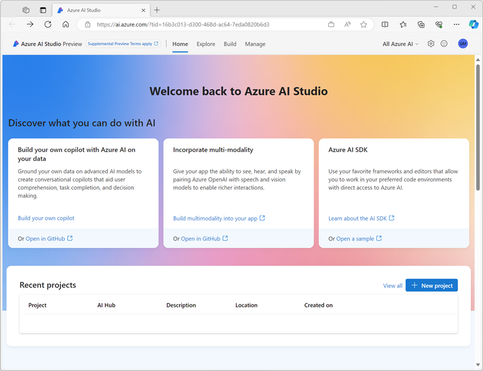
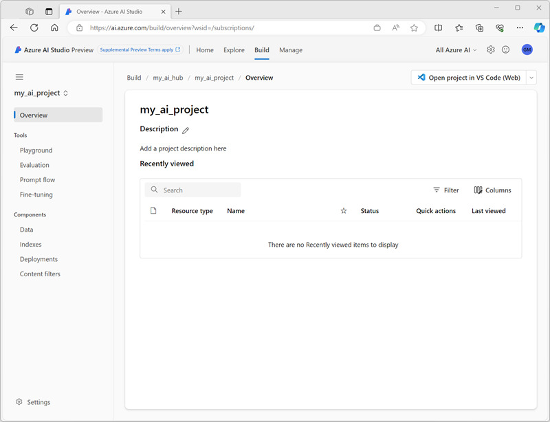

---
lab:
  title: Azure AI Studio を探索する
---

# Azure AI Studio を探索する

この演習では、Azure AI Studio を使用してプロジェクトを作成し、生成 AI モデルを探索します。

> この演習を完了するには、Azure OpenAI サービスへのアクセスについて Azure サブスクリプションが承認されている必要があります。 [登録フォーム](https://learn.microsoft.com/legal/cognitive-services/openai/limited-access)に入力して、Azure OpenAI モデルへのアクセスを要求します。

この演習は約 **30** 分かかります。

## Azure AI Studio を開く

まずは Azure AI Studio を調べることから始めましょう。

1. Web ブラウザーで [https://ai.azure.com](https://ai.azure.com) を開き、Azure の資格情報を使ってサインインします。 Azure AI Studio のホーム ページは次の画像のようになります。

    

1. ホーム ページの情報を確認し、各タブを表示して、モデルと機能の探索、プロジェクトの作成、リソースの管理のオプションを確認します。

## Azure AI ハブを作成する

プロジェクトをホストするには、Azure サブスクリプション内に Azure AI ハブが必要です。 このリソースは、プロジェクトの作成中に作成するか、事前にプロビジョニングすることができます (この演習ではこちらを行います)。

1. **[管理]** セクションで、**[すべてのハブ]** を選択した後、**[+ 新しいハブ]** を選択します。 次の設定を使用して新しいハブを作成します。
    - **ハブ名**:*一意の名前*
    - **[サブスクリプション]**:"*ご自身の Azure サブスクリプション*"
    - **[リソース グループ]**: "一意の名前で新しいリソース グループを作成するか、既存のものを選びます"**
    - **[場所]**: *以下のいずれかのリージョンから**ランダム**に選択する*\*
        - オーストラリア東部
        - カナダ東部
        - 米国東部
        - 米国東部 2
        - フランス中部
        - 東日本
        - 米国中北部
        - スウェーデン中部
        - スイス北部
        - 英国南部
    - **Azure AI サービスまたは Azure OpenAI への接続**:新しい AI サービスを作成するか既存のものを使用するかを選択する**
    - **Azure AI 検索への接続**:接続をスキップする

    > \* Azure OpenAI リソースは、リージョンのクォータによってテナント レベルで制限されます。 一覧表示されているリージョンには、この演習で使用されるモデル タイプの既定のクォータが含まれています。 リージョンをランダムに選択すると、テナントを他のユーザーと共有するシナリオで、1 つのリージョンがクォータ制限に達するリスクが軽減されます。 演習の後半でクォータ制限に達した場合は、別のリージョンに別のリソースを作成する必要が生じる可能性があります。

    Azure AI ハブが作成されると、次の画像のようになるはずです。

    

1. 新しいブラウザー タブを開き ([Azure AI Studio] タブは開いたままにします)、Azure portal ([https://portal.azure.com](https://portal.azure.com?azure-portal=true)) に移動します。プロンプトが表示されたら、Azure の資格情報を使ってサインインします。
1. Azure AI ハブを作成したリソース グループに移動し、作成された Azure リソースを表示します。

    

1. Azure AI Studio ブラウザー タブに戻ります。
1. Azure AI ハブのページの左側のペインでそれぞれのページを表示し、作成および管理できる成果物を確認します。 **[接続]** ページで、Azure OpenAI と AI サービスへの接続が既に作成されていることを確認します。

## プロジェクトの作成

Azure AI ハブは、1 つ以上の "プロジェクト" を定義できる共同作業用のワークスペースとして機能します。** Azure AI ハブ内にプロジェクトを作成してみましょう。

1. Azure AI Studio で、先ほど作成したハブ内にいることを確認します (画面の上部にあるパスを確認することで、自分の場所を確認できます)。
1. 左側のメニューを使用して、**[すべてのプロジェクト]** に移動します。
1. **[+ New project]** を選択します。
1. **[新しいプロジェクトの作成]** ウィザードで、次の設定を使ってプロジェクトを作成します。
    - **現在のハブ**:あなたの AI ハブ**
    - **プロジェクト名**:"プロジェクトの一意の名前"**
1. プロジェクトが作成されるまで待ちます。 準備ができたら、次の画像のようになります。

    

1. 左側のペインにあるページを表示して各セクションを展開し、プロジェクト内で実行できるタスクと管理できるリソースを確認します。

## モデルのデプロイとテスト

プロジェクトを使って、生成 AI モデルに基づいた複雑な AI ソリューションを作成できます。 Azure AI Studio で使用できるすべての開発オプションを詳しく説明することはこの演習の範囲を超えていますが、プロジェクト内でモデルを操作するための基本的な方法をいくつか説明します。

1. プロジェクトの左側のペインの **[コンポーネント]** セクションで、**[デプロイ]** ページを選択します。
1. **[デプロイ]** ページの **[モデル デプロイ]** タブで、**[+ デプロイの作成]** を選択します。
1. 一覧から **gpt-35-turbo** モデルを検索し、選択して確認します。
1. 以下の設定を使用してモデルをデプロイします。
    - **デプロイ名**:"モデル デプロイの一意の名前"**
    - **モデルのバージョン**: *Select the default version (既定のバージョンの選択)*
    - **デプロイの種類**:Standard
    - **Azure OpenAI リソースに接続済み**:ハブの作成時に作成された既定の接続を選択する**
    - **1 分あたりのトークン数のレート制限 (1,000 単位)**:5,000
    - **コンテンツ フィルター**: 既定

    > **注**:TPM を減らすと、ご利用のサブスクリプション内で使用可能なクォータが過剰に消費されることを回避するのに役立ちます。 この演習で使用するデータには、5,000 TPM で十分です。

1. モデルがデプロイされたら、デプロイの概要ページで **[プレイグラウンドで開く]** を選択します。
1. **[チャット プレイグラウンド]** ページで、**[デプロイ]** セクション内でご利用のモデル デプロイが選択されていることを確認します。
1. チャット ウィンドウで、以下のように「AI とは何ですか?」のようなクエリを入力し、応答を確認します。**

    

## クリーンアップ

Azure AI Studio を確認し終わったら、不要な Azure コストが発生しないように、この演習で作成したリソースを削除する必要があります。

1. Azure portal が表示されているブラウザー タブに戻り (または、新しいブラウザー タブで [Azure portal](https://portal.azure.com?azure-portal=true) をもう一度開き)、この演習で使ったリソースがデプロイされているリソース グループの内容を表示します。
1. ツール バーの **[リソース グループの削除]** を選びます。
1. リソース グループ名を入力し、削除することを確認します。
